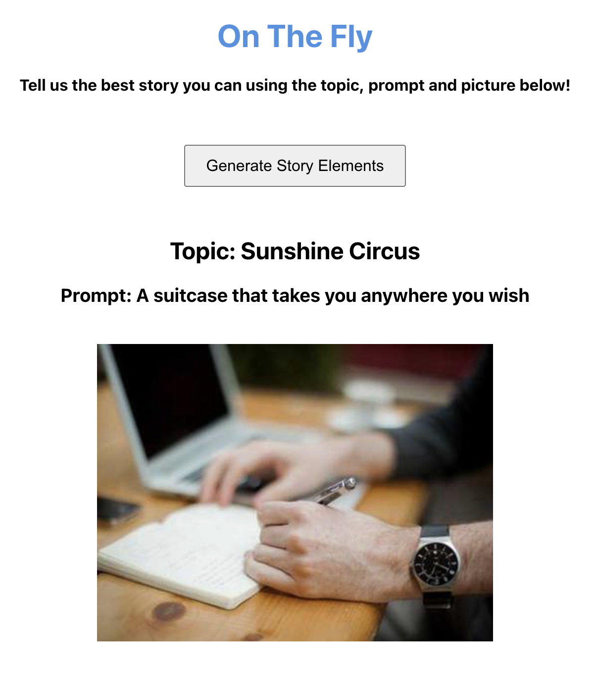

# On the Fly
A side project to people improve their improv and story telling abilities by being tasked to tell a story given a random topic, prompt, and image! 
> Done by: Zohair Ahmed



## Running Locally
### Mac
1. Install `homebrew`
```
/bin/bash -c "$(curl -fsSL https://raw.githubusercontent.com/Homebrew/install/HEAD/install.sh)"
```

2. Install node
```
brew install node
```
3. Clone the Project
```
git clone https://github.com/Zohair-Ahmed/OnTheFly.git (HTTPS) OR
git clone git@github.com:Zohair-Ahmed/OnTheFly.git (SSH)
```

4. `cd` to project root
5. In one terminal, start the node server
```
node server.js
```
6. In another directory, ensure you are in the `client` directory, and start app
```
npm start
```
7. Open the app. Type in the following in you web browser
```
localhost:3000
```
8. Get story telling!